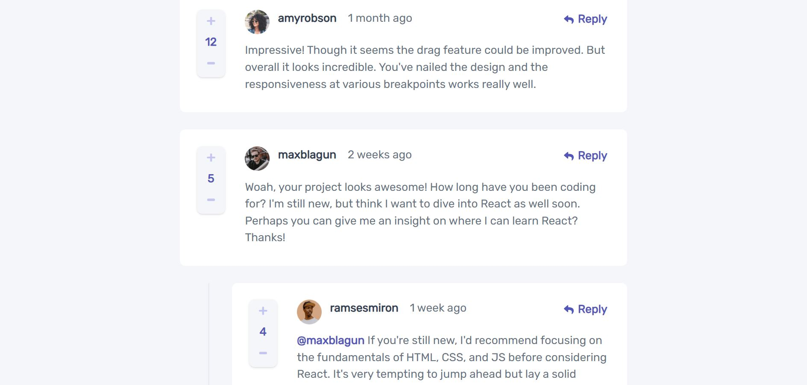

# Frontend Mentor - Interactive comments section solution

This is a solution to the [Interactive comments section challenge on Frontend Mentor](https://www.frontendmentor.io/challenges/interactive-comments-section-iG1RugEG9). Frontend Mentor challenges help you improve your coding skills by building realistic projects.

## Table of contents

- [Overview](#overview)
  - [The challenge](#the-challenge)
  - [Screenshot](#screenshot)
  - [Links](#links)
- [My process](#my-process)
  - [Built with](#built-with)
  - [What I learned](#what-i-learned)
  - [Useful resources](#useful-resources)
- [Author](#author)

## Overview

This is my third challenge from frontendmentor.io , it is a very good website to brush up your skills, you can use any tools you want to complete this project . This application was developed using reactJs and tailwind-css. It is a level 3 challenge.

### The challenge

Users should be able to:

- View the optimal layout for the app depending on their device's screen size
- See hover states for all interactive elements on the page
- Create, Read, Update, and Delete comments and replies
- Upvote and downvote comments
- **Bonus**: If you're building a purely front-end project, use `localStorage` to save the current state in the browser that persists when the browser is refreshed.
- **Bonus**: Instead of using the `createdAt` strings from the `data.json` file, try using timestamps and dynamically track the time since the comment or reply was posted.

### Screenshot

### Links

- Solution URL: [Github](https://github.com/DhairyaSehgal07/Interactive-comments-section)
- Live Site URL: [interactive-comments-section07](https://interactive-comments-section07.netlify.app/)

## My process

### Built with

- Semantic HTML5 markup
- CSS custom properties
- Flexbox
- Mobile-first workflow
- [React](https://reactjs.org/) - JS library
- [Tailwind css](https://tailwindcss.com/) - For styles

### What I learned

I had a fantastic learning experience with this project as I gained a deep understanding of how states function. Moreover, I mastered the creation of toggle buttons, and I successfully implemented the Mobile First workflow method, resulting in a seamlessly responsive design.

### Useful resources

- [React dev docs](https://react.dev/) - This helped me to gain an understanding of react hooks
- [Tailwind css docs](https://tailwindcss.com/) - This is an amazing article which helped me find the suitable styles for my components.It also helped me with the syntax of tailwind css

## Author

- Website - [Dhairya Sehgal](https://dhairya-sehgal-portfolio.netlify.app/)
- Frontend Mentor - [@DhairyaSehgal07](https://www.frontendmentor.io/profile/DhairyaSehgal07)
